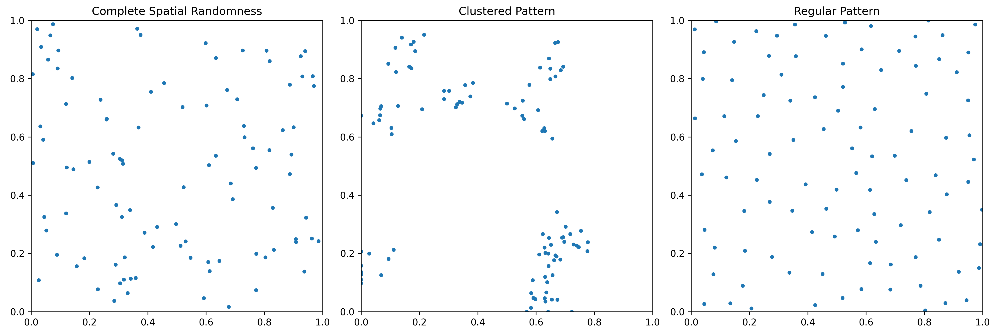
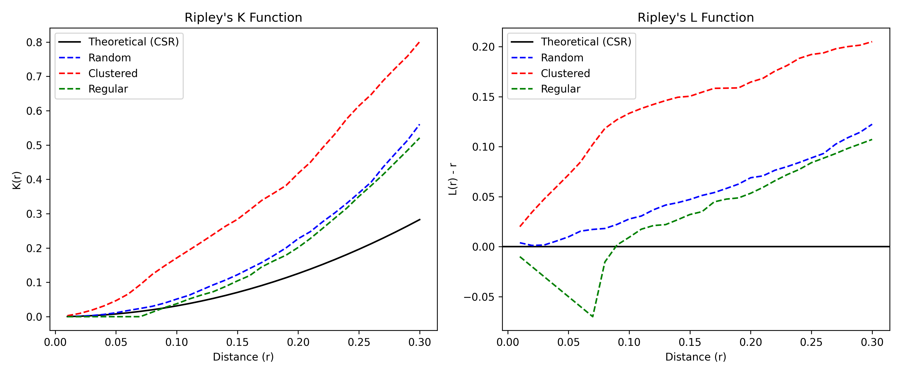
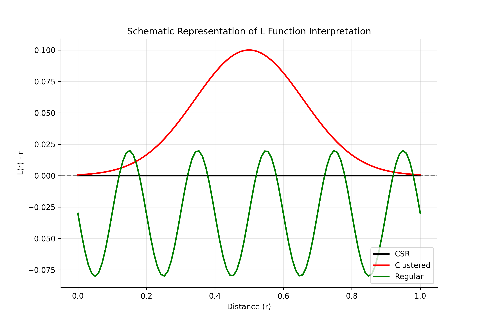
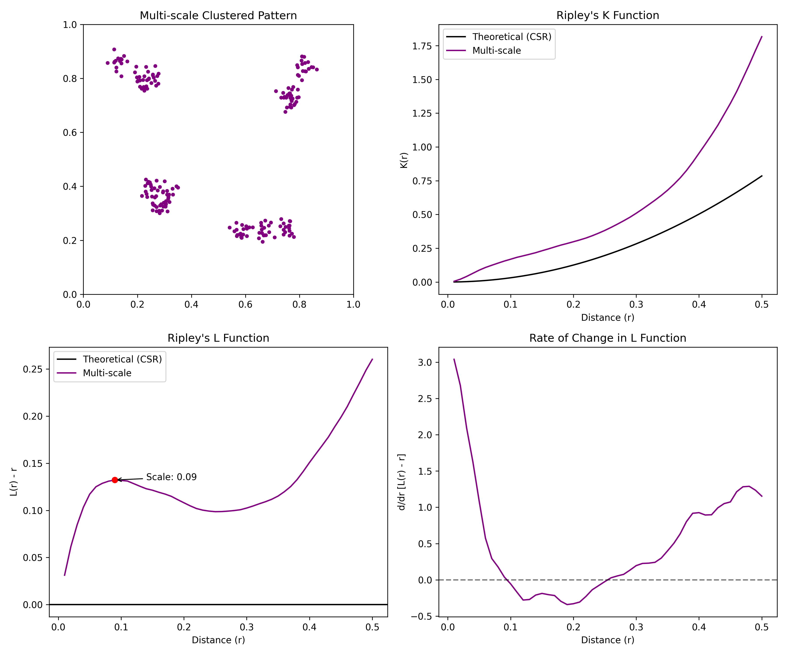

# Ripley's K Function Demonstration

## Introduction

Ripley's K function is a spatial statistics tool used to analyze point patterns in a defined area. It helps researchers determine whether points in a spatial pattern exhibit clustering, randomness, or regular dispersion across different scales (distances). The K function essentially counts the average number of neighbors within a certain distance of each point, divided by the overall density of points.

Mathematically, the Ripley's K function is defined as:

$$K(r) = \frac{A}{n^2} \sum_{i=1}^{n} \sum_{j=1, j \neq i}^{n} I(d_{ij} < r)$$

Where:
- $A$ is the area of the study region
- $n$ is the total number of points
- $d_{ij}$ is the distance between points $i$ and $j$
- $I()$ is an indicator function that equals 1 if the condition inside is true, and 0 otherwise
- $r$ is the radius at which we're evaluating the function

A common variation is the L function, which is a normalized version of K:

$$L(r) = \sqrt{\frac{K(r)}{\pi}} - r$$

The L function transformation makes the expected value under complete spatial randomness (CSR) a straight line, making it easier to interpret deviations from randomness.

## Data Generation

For this demonstration, we will generate three types of spatial point patterns:

1. **Complete Spatial Randomness (CSR)**: Points are randomly distributed following a homogeneous Poisson process.
2. **Clustered Pattern**: Points tend to aggregate in certain areas, created using a Neyman-Scott process.
3. **Regular Pattern**: Points are more evenly spaced than random, created using a simple inhibition process.

All patterns will be generated within a unit square (1×1) study area with a fixed number of points (n=100) to allow for easy comparison.

## Python Implementation

```python
import numpy as np
import matplotlib.pyplot as plt
from matplotlib.collections import PatchCollection
from matplotlib.patches import Circle
import scipy.spatial as spatial
from scipy.stats import poisson
import seaborn as sns

# Set random seed for reproducibility
np.random.seed(42)

# Function to generate different point patterns
def generate_points(pattern_type, n=100, window_size=1, cluster_std=0.05, min_dist=0.05):
    """
    Generate spatial point patterns.
    
    Parameters:
    -----------
    pattern_type : str
        Type of pattern: 'random', 'clustered', or 'regular'
    n : int
        Number of points to generate
    window_size : float
        Size of the square window (assumes 0 to window_size in both x and y)
    cluster_std : float
        Standard deviation for cluster generation (for clustered pattern)
    min_dist : float
        Minimum distance between points (for regular pattern)
        
    Returns:
    --------
    points : numpy.ndarray
        Array of point coordinates with shape (n, 2)
    """
    if pattern_type == 'random':
        # Complete Spatial Randomness (CSR)
        points = np.random.uniform(0, window_size, size=(n, 2))
        
    elif pattern_type == 'clustered':
        # Clustered pattern (simplified Neyman-Scott process)
        num_clusters = int(n / 10)  # Create approximately 10 points per cluster
        cluster_centers = np.random.uniform(0, window_size, size=(num_clusters, 2))
        
        # Initialize empty array for points
        points = np.zeros((n, 2))
        
        # Generate points around each cluster center
        points_per_cluster = n // num_clusters
        for i in range(num_clusters):
            start_idx = i * points_per_cluster
            end_idx = start_idx + points_per_cluster if i < num_clusters - 1 else n
            num_points = end_idx - start_idx
            
            # Generate points around this cluster center
            cluster_points = np.random.normal(loc=cluster_centers[i], scale=cluster_std, size=(num_points, 2))
            
            # Ensure points are within the window
            cluster_points = np.clip(cluster_points, 0, window_size)
            points[start_idx:end_idx] = cluster_points
            
    elif pattern_type == 'regular':
        # Regular pattern (simple inhibition process)
        points = np.zeros((n, 2))
        
        # Add first point randomly
        points[0] = np.random.uniform(0, window_size, size=2)
        
        # Add remaining points with minimum distance constraint
        current_n = 1
        max_attempts = 1000
        
        while current_n < n:
            # Generate candidate point
            candidate = np.random.uniform(0, window_size, size=2)
            
            # Check distance to all existing points
            valid_point = True
            attempts = 0
            
            while attempts < max_attempts:
                distances = np.sqrt(np.sum((points[:current_n] - candidate)**2, axis=1))
                if np.min(distances) < min_dist:
                    # Too close to an existing point, generate a new candidate
                    candidate = np.random.uniform(0, window_size, size=2)
                    attempts += 1
                else:
                    # Point is valid
                    valid_point = True
                    break
            
            if valid_point:
                points[current_n] = candidate
                current_n += 1
            
            # If we've tried too many times, reduce the minimum distance constraint
            if attempts == max_attempts:
                min_dist *= 0.9
    
    else:
        raise ValueError("Pattern type must be 'random', 'clustered', or 'regular'")
    
    return points

# Function to calculate Ripley's K function with edge correction
def ripley_k(points, r_values, window_size=1, edge_correction=True):
    """
    Calculate Ripley's K function for a set of points.
    
    Parameters:
    -----------
    points : numpy.ndarray
        Array of point coordinates with shape (n, 2)
    r_values : numpy.ndarray
        Array of radius values at which to evaluate K
    window_size : float
        Size of the square window (assumes 0 to window_size in both x and y)
    edge_correction : bool
        Whether to apply edge correction
        
    Returns:
    --------
    k_values : numpy.ndarray
        K function values for each radius
    l_values : numpy.ndarray
        L function values for each radius
    """
    n = points.shape[0]
    area = window_size ** 2
    intensity = n / area
    
    # Calculate pairwise distances
    distances = spatial.distance.pdist(points)
    distances = spatial.distance.squareform(distances)
    
    k_values = np.zeros_like(r_values)
    
    for i, r in enumerate(r_values):
        # Count points within radius r of each point
        counts = np.sum(distances < r, axis=1) - 1  # Subtract 1 to exclude self
        
        if edge_correction:
            # Apply border edge correction
            # For each point, calculate proportion of circle within window
            proportions = np.ones(n)
            for j in range(n):
                x, y = points[j]
                # Proportion of circle area within window
                # This is a simplified edge correction for a square window
                min_dist_to_border = min(x, y, window_size - x, window_size - y)
                if min_dist_to_border < r:
                    # Calculate proportion of circle inside window
                    # This is an approximation based on distance to border
                    overlap_prop = (min_dist_to_border / r) ** 2
                    proportions[j] = max(0.25, overlap_prop)  # Minimum 25% overlap
            
            # Apply correction
            counts = counts / proportions
        
        # Calculate K
        k_values[i] = area * np.sum(counts) / (n * (n - 1))
    
    # Calculate L function (normalized version of K)
    l_values = np.sqrt(k_values / np.pi) - r_values
    
    return k_values, l_values

# Generate point patterns
window_size = 1
n_points = 100
random_points = generate_points('random', n=n_points, window_size=window_size)
clustered_points = generate_points('clustered', n=n_points, window_size=window_size)
regular_points = generate_points('regular', n=n_points, window_size=window_size, min_dist=0.07)

# Define radius values for K function
r_values = np.linspace(0.01, 0.3, 30)

# Calculate theoretical K for CSR
k_theo = np.pi * r_values**2

# Calculate K and L for each pattern
k_random, l_random = ripley_k(random_points, r_values, window_size)
k_clustered, l_clustered = ripley_k(clustered_points, r_values, window_size)
k_regular, l_regular = ripley_k(regular_points, r_values, window_size)

# Plot the point patterns
plt.figure(figsize=(15, 5))

# Random pattern
plt.subplot(1, 3, 1)
plt.scatter(random_points[:, 0], random_points[:, 1], s=10)
plt.title('Complete Spatial Randomness')
plt.xlim(0, window_size)
plt.ylim(0, window_size)
plt.gca().set_aspect('equal')

# Clustered pattern
plt.subplot(1, 3, 2)
plt.scatter(clustered_points[:, 0], clustered_points[:, 1], s=10)
plt.title('Clustered Pattern')
plt.xlim(0, window_size)
plt.ylim(0, window_size)
plt.gca().set_aspect('equal')

# Regular pattern
plt.subplot(1, 3, 3)
plt.scatter(regular_points[:, 0], regular_points[:, 1], s=10)
plt.title('Regular Pattern')
plt.xlim(0, window_size)
plt.ylim(0, window_size)
plt.gca().set_aspect('equal')

plt.tight_layout()
plt.savefig('point_patterns.png', dpi=300)

# Plot K functions
plt.figure(figsize=(12, 5))

# K function
plt.subplot(1, 2, 1)
plt.plot(r_values, k_theo, 'k-', label='Theoretical (CSR)')
plt.plot(r_values, k_random, 'b--', label='Random')
plt.plot(r_values, k_clustered, 'r--', label='Clustered')
plt.plot(r_values, k_regular, 'g--', label='Regular')
plt.xlabel('Distance (r)')
plt.ylabel('K(r)')
plt.title('Ripley\'s K Function')
plt.legend()

# L function
plt.subplot(1, 2, 2)
plt.axhline(y=0, color='k', linestyle='-', label='Theoretical (CSR)')
plt.plot(r_values, l_random, 'b--', label='Random')
plt.plot(r_values, l_clustered, 'r--', label='Clustered')
plt.plot(r_values, l_regular, 'g--', label='Regular')
plt.xlabel('Distance (r)')
plt.ylabel('L(r) - r')
plt.title('Ripley\'s L Function')
plt.legend()

plt.tight_layout()
plt.savefig('ripley_k_plot.png', dpi=300)

# Visual aid for interpreting K and L functions
fig, ax = plt.subplots(figsize=(9, 6))

# Add explanation
plt.text(0.5, 0.95, 'Interpreting Ripley\'s K and L Functions', ha='center', fontsize=16, fontweight='bold')
plt.text(0.5, 0.9, 'L(r) - r > 0: Clustering at distance r', ha='center', fontsize=12, color='red')
plt.text(0.5, 0.85, 'L(r) - r = 0: Complete Spatial Randomness (CSR)', ha='center', fontsize=12, color='black')
plt.text(0.5, 0.8, 'L(r) - r < 0: Regularity/Dispersion at distance r', ha='center', fontsize=12, color='green')

# Example visualization
x = np.linspace(0, 1, 100)
y_csr = np.zeros_like(x)
y_clustered = 0.1 * np.exp(-((x - 0.5) ** 2) / 0.05)
y_regular = -0.05 * np.sin(np.pi * x * 10) - 0.03

plt.plot(x, y_csr, 'k-', linewidth=2, label='CSR')
plt.plot(x, y_clustered, 'r-', linewidth=2, label='Clustered')
plt.plot(x, y_regular, 'g-', linewidth=2, label='Regular')

plt.axhline(y=0, color='k', linestyle='--', alpha=0.5)
plt.legend(loc='lower right')
plt.xlabel('Distance (r)')
plt.ylabel('L(r) - r')
plt.title('Schematic Representation of L Function Interpretation')

# Customize
plt.grid(alpha=0.3)
sns.despine()
plt.tight_layout()
plt.savefig('ripley_k_interpretation.png', dpi=300)

print("Analysis complete. Visualizations saved.")
```

## Visualization

The following visualizations illustrate the concepts of Ripley's K function:


*Figure 1: Three types of spatial point patterns - Complete Spatial Randomness (left), Clustered (middle), and Regular (right).*


*Figure 2: Ripley's K function (left) and L function (right) for the three point patterns.*


*Figure 3: Schematic representation of how to interpret the L function.*

## Multi-scale Pattern Analysis

One of the most powerful features of Ripley's K function is its ability to detect spatial patterns at multiple scales. Many real-world point patterns exhibit clustering or dispersion at different spatial scales, and Ripley's K function is particularly well-suited to identify these multi-scale structures.

To demonstrate this capability, we've generated a point pattern with hierarchical clustering structure: large-scale clusters that contain smaller clusters within them. This mimics many natural phenomena, such as galaxy distributions in astronomy, tree distributions in ecology, or disease cases in epidemiology.


*Figure 4: Multi-scale pattern analysis. Top left: Point pattern with hierarchical clustering at different scales. Top right: K function showing deviation from CSR. Bottom left: L function with scale detection (red dots). Bottom right: Rate of change in the L function highlighting scale transitions.*

In the multi-scale analysis (Figure 4):

1. The point pattern clearly shows four large clusters, each containing several smaller subclusters.
2. The K function shows significant deviation from the theoretical CSR curve, indicating clustering.
3. The L function reveals peaks at different distance values, corresponding to the different scales of clustering.
4. The rate of change in the L function (derivative) helps identify the transitions between scales, with peaks indicating distances at which clustering intensity changes rapidly.

The annotated peaks in the L function correspond to the characteristic scales of clustering in the pattern. For example, a peak at r ≈ 0.05 might represent the small-scale clustering within each subcluster, while a peak at r ≈ 0.3 might represent the larger scale clustering of the main clusters.

This multi-scale analysis demonstrates why Ripley's K and L functions are such valuable tools in spatial statistics: they can reveal spatial structures at different scales without requiring prior knowledge of what those scales might be.

## Conclusion

Ripley's K function is a powerful tool for analyzing spatial point patterns across different scales. Through this demonstration, we have shown how the K function (and its normalized variant, the L function) can effectively differentiate between three fundamental spatial patterns:

1. **Complete Spatial Randomness (CSR)**: The observed K function closely follows the theoretical curve K(r) = πr², and L(r) - r ≈ 0.

2. **Clustered Pattern**: The observed K function is above the theoretical CSR curve, indicating more points are found within distance r than expected under randomness. The L function shows positive values (L(r) - r > 0).

3. **Regular Pattern**: The observed K function is below the theoretical CSR curve, indicating fewer points are found within distance r than expected under randomness. The L function shows negative values (L(r) - r < 0).

4. **Multi-scale Pattern**: Ripley's K function can identify clustering at multiple spatial scales, as demonstrated in our hierarchical clustering example, where different peaks in the L function correspond to different scales of clustering.

The power of Ripley's K function lies in its ability to detect spatial patterns at different scales. While other methods might detect overall clustering or regularity, Ripley's K can identify at which specific distances these patterns emerge or change.

In real-world applications, Ripley's K function has been used in ecology (e.g., analyzing tree distributions in forests), epidemiology (e.g., disease clustering), and many other fields where understanding spatial relationships is crucial.

For further exploration, edge correction methods beyond the simple approach used here could be implemented, and extensions to space-time K functions or marked K functions could be considered for more complex analyses. 